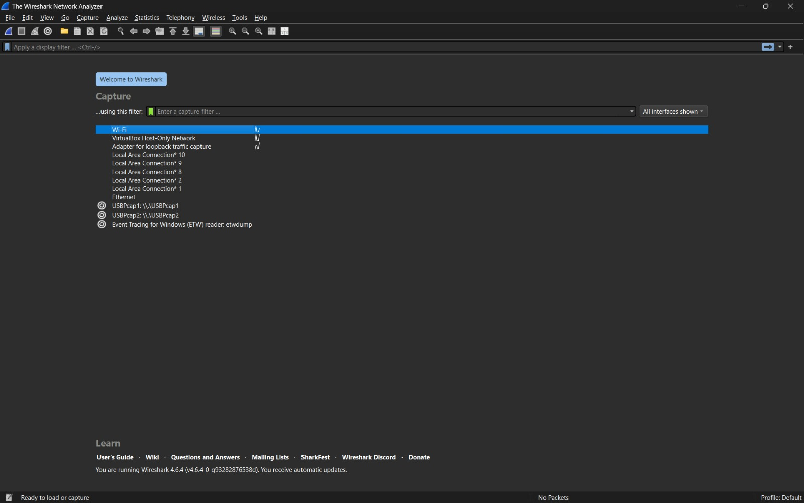
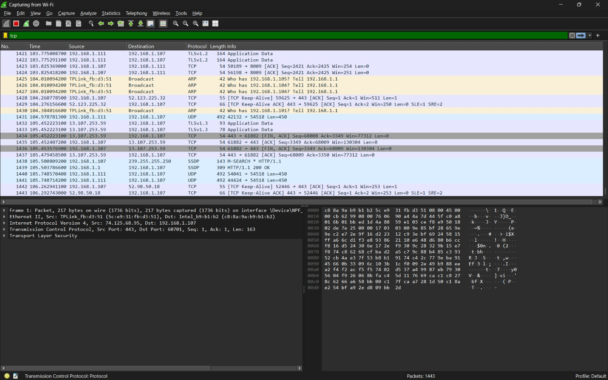
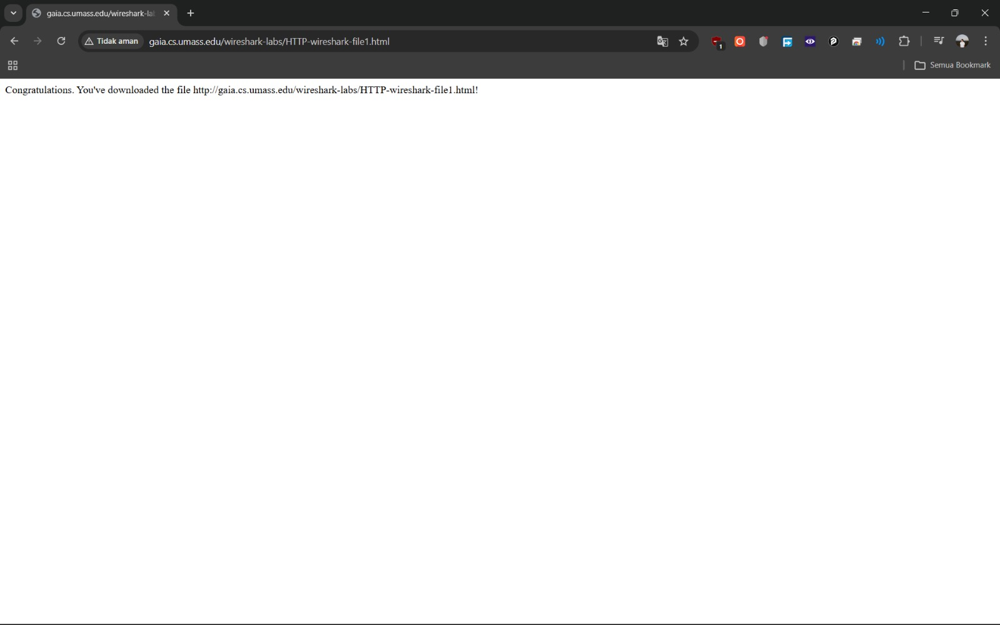
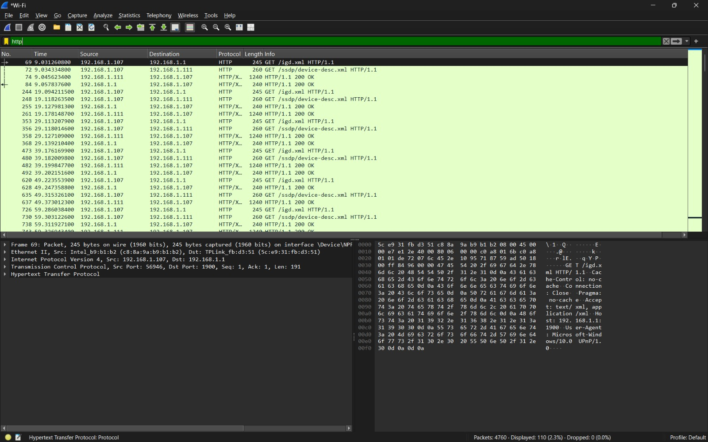
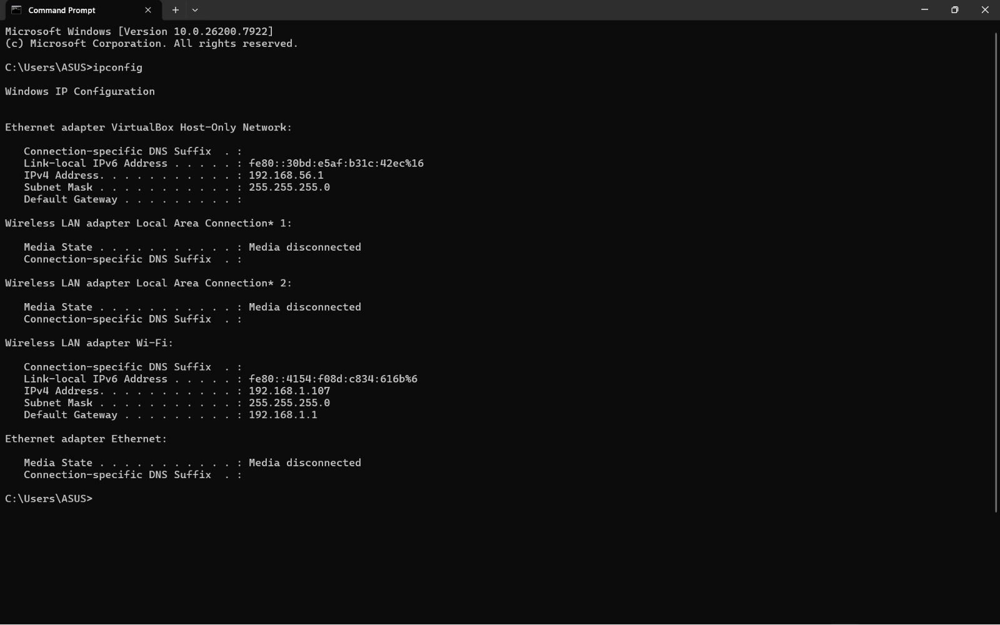

# Laporan Praktikum Jarkom IF

## Tujuan Praktikum
1. Memahami mekanisme kerja protokol HTTP, terutama proses pertukaran HTTP GET dan HTTP Response antara client (browser) dengan server.
2. Menggunakan aplikasi Wireshark sebagai packet sniffer untuk menangkap paket jaringan yang terjadi ketika mengakses suatu halaman web.
3. Mengamati dan mengenali paket HTTP yang muncul saat browser melakukan permintaan file HTML dari server.
4. Menganalisis isi paket HTTP, seperti request method, request URI, serta response yang diberikan oleh server.
5. Memahami bagaimana proses komunikasi client–server pada jaringan dengan melihat secara langsung paket data yang dikirim dan diterima.

## Langkah Percobaan
1. Membuka browser web pada komputer.
2. Menjalankan aplikasi Wireshark yang telah diunduh dan diinstal sebelumnya.
3. Memilih interface jaringan yang sedang digunakan, misalnya Wi-Fi.
4. Klik tombol Start untuk memulai proses penangkapan paket jaringan.
5. Pada bagian Display Filter di bagian atas Wireshark, ketik http untuk menampilkan paket HTTP.
6. Tunggu sekitar satu menit sebelum memulai proses pengambilan paket menggunakan Wireshark.
7. Masukkan alamat berikut pada browser:
http://gaia.cs.umass.edu/wireshark-labs/HTTP-wireshark-file1.html
8. Setelah itu browser akan menampilkan sebuah file HTML sederhana yang hanya berisi satu baris.
Terakhir, hentikan proses packet capture pada Wireshark.

## Lampiran 
Hasil Percobaan:

