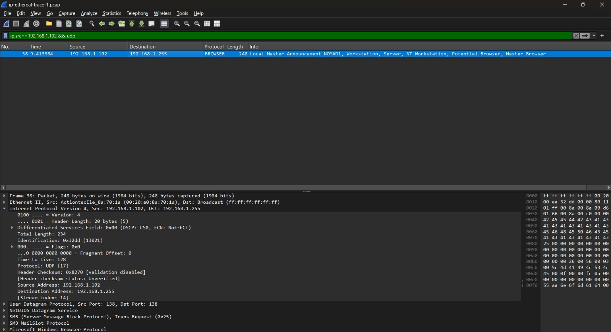

# Laporan Praktikum Jaringan Komputer

## Modul 10 – IP

**Nama:** EFRAN GUSTINE YULIANTO       
**NIM:** 103072400046

## Tujuan
Menganalisis dan memahami mekanisme kerja serta karakteristik protokol IP (*Internet Protocol*) melalui pemantauan paket data menggunakan aplikasi Wireshark.

## Percobaan Praktikum

### 10.2.1 

#### 10.2.1 Bagian 1: IPv4 Dasar
1. Mengunduh berkas (*file*) data aktivitas jaringan bernama `wireshark-traces` yang telah disediakan pada panduan modul.
2. Mengubah ekstensi berkas tersebut dengan menambahkan format `.pcap` di akhir nama berkas sehingga menjadi `wireshark-traces.pcap`. Penambahan ekstensi ini bertujuan agar berkas log jaringan dapat dibaca dan diekstrak secara sempurna oleh aplikasi Wireshark.
3. Membuka berkas tersebut di Wireshark, kemudian menerapkan sintaks penyaringan pada kolom filter sebagai berikut:  
   `ip.src==192.168.1.102 && udp`  
   Langkah ini dilakukan untuk menyortir lalu lintas data agar Wireshark hanya menampilkan paket UDP yang berasal dari alamat IP sumber (*source*) tersebut, seperti yang tertera pada hasil tangkapan layar di bawah ini.

### 10.2.3

#### 10.2.3 Bagian 3: IPv6
1. Pada pengamatan IPv6, perbedaan mendasar dengan IPv4 terletak pada struktur penulisan alamatnya. Jika alamat IPv4 seluruhnya direpresentasikan menggunakan format penomoran desimal (angka), maka alamat IPv6 menggunakan format heksadesimal yang mengombinasikan angka dan huruf (A-F) yang dipisahkan oleh tanda titik dua (*colon*). Perbedaan ini dapat diidentifikasi secara jelas melalui kolom *source* maupun *destination* pada panel Wireshark.