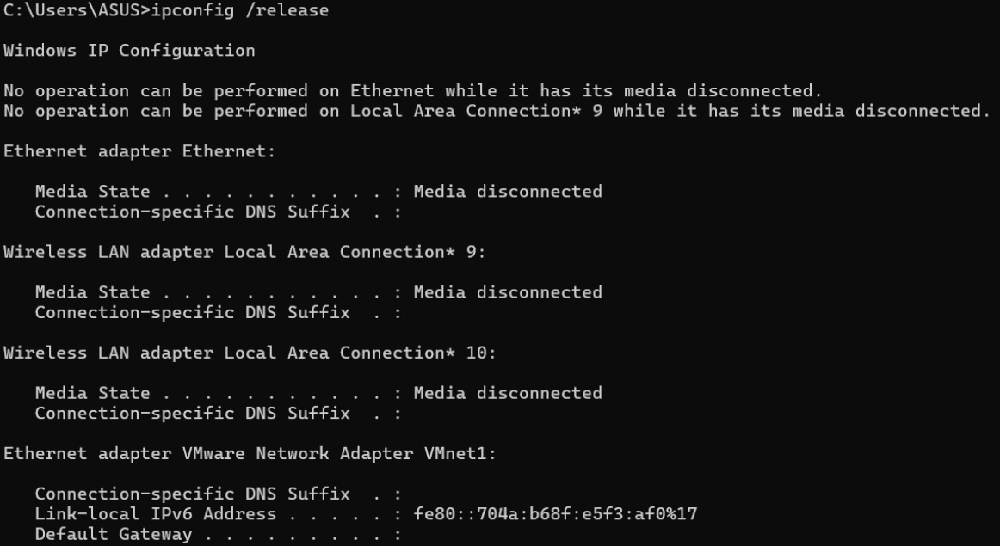
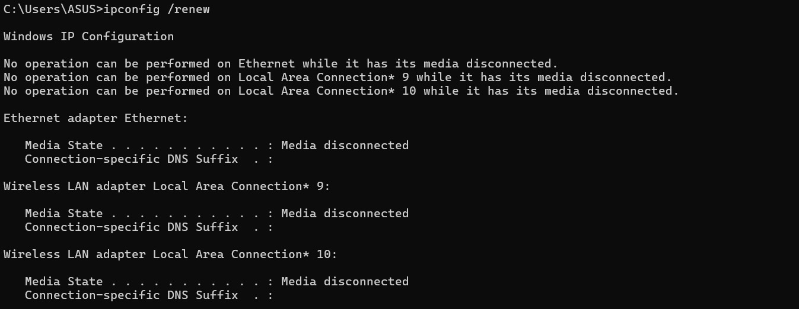
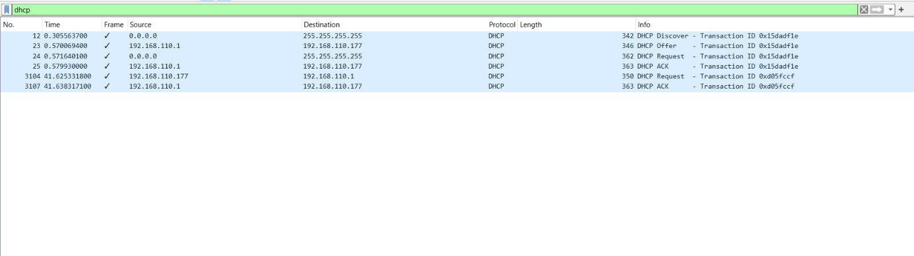
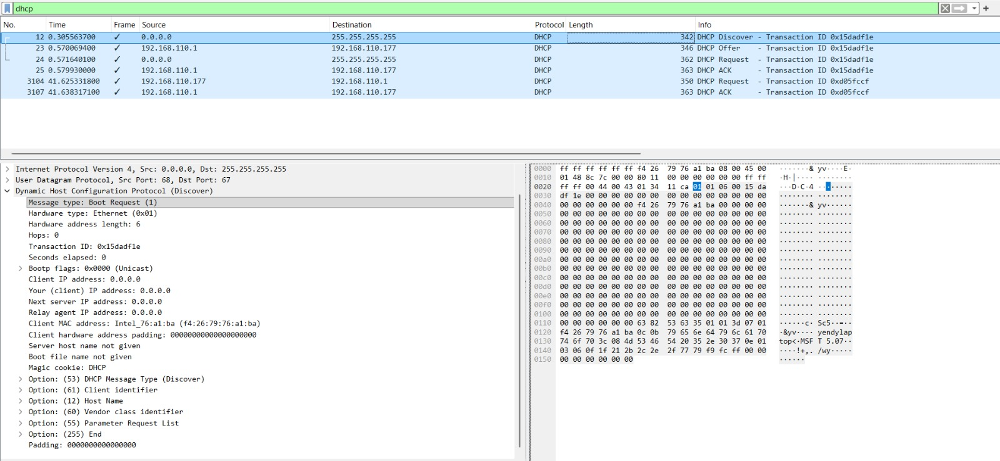
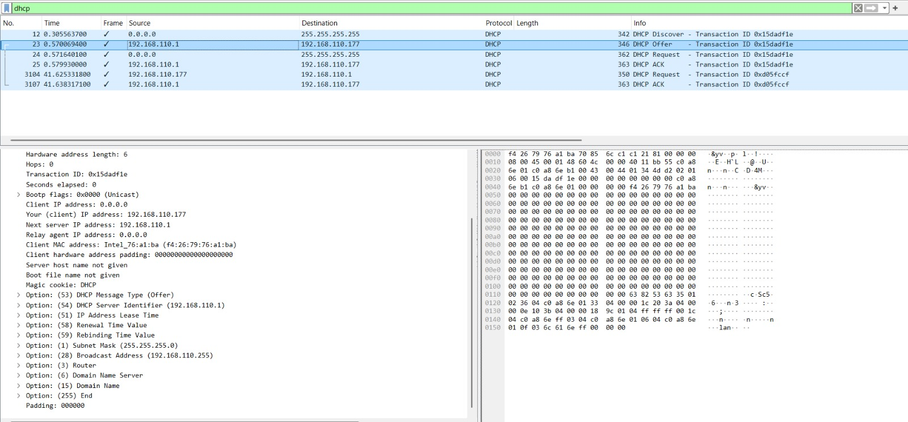
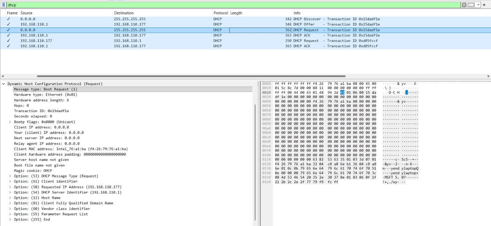
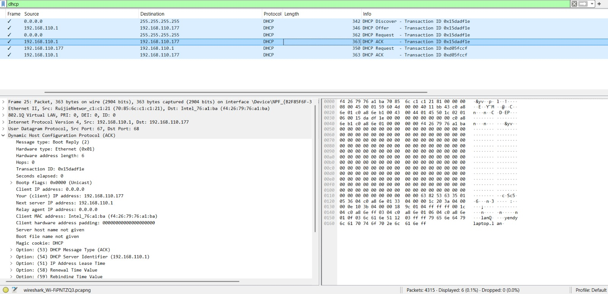

# Laporan Praktikum Jaringan Komputer

## Modul 11 – DHCP

**Nama:** EFRAN GUSTINE YULIANTO
**NIM:** 103072400046

## Tujuan
Menganalisis dan mendalami mekanisme kerja protokol DHCP (Dynamic Host Configuration Protocol) melalui pemantauan lalu lintas data menggunakan aplikasi Wireshark.

## Langkah Praktikum
1. Menjalankan perangkat lunak Wireshark pada perangkat.
2. Menentukan dan memilih interface jaringan yang sedang aktif digunakan.
3. Memulai perekaman (capture) aktivitas paket data pada jaringan.
4. Membuka Command Prompt (CMD), kemudian mengeksekusi rangkaian perintah berikut secara berurutan:
ipconfig /release
ipconfig /renew
5. Menghentikan proses perekaman paket data pada Wireshark.
6. Menerapkan penyaringan dengan kata kunci dhcp atau bootp pada kolom filter Wireshark.
7. Mengidentifikasi serta menganalisis rangkaian paket transaksi DHCP yang terdiri dari Discover, Offer, Request, dan ACK.

## Hasil Pengamatan

### DHCP Discover
Paket inisiasi yang disiarkan (broadcast) oleh pihak client ke dalam jaringan dengan tujuan mendeteksi keberadaan server DHCP yang aktif.

### DHCP Offer
Tanggapan dari satu atau beberapa server DHCP yang berisi tawaran konfigurasi parameter jaringan (seperti alamat IP) untuk digunakan oleh client.

### DHCP Request
Pesan konfirmasi dari client yang menyatakan persetujuan untuk mengadopsi penawaran alamat IP spesifik yang sebelumnya diajukan oleh server DHCP.

### DHCP ACK
Respons final dari server DHCP yang memvalidasi bahwa alamat IP tersebut resmi dialokasikan kepada client untuk durasi waktu (lease time) tertentu.

## Analisis
Berdasarkan hasil pengujian di atas, siklus alokasi alamat IP berjalan sesuai dengan standar mekanisme DORA (Discover, Offer, Request, Acknowledgement). Prosedur ini berlangsung seluruhnya secara dinamis dan otomatis, sehingga memangkas kebutuhan intervensi pengguna dalam melakukan konfigurasi IP secara manual pada host.

Melalui pemanfaatan Wireshark, seluruh struktur anatomi paket data DHCP yang melintasi jaringan dapat dibedah secara transparan. Dari hasil capture, kita dapat memverifikasi berbagai parameter jaringan penting yang didistribusikan oleh server, seperti IP address yang dipinjamkan, subnet mask, default gateway, hingga alamat DNS server.

## Kesimpulan
Protokol DHCP berfungsi sebagai penyedia konfigurasi parameter jaringan secara dinamis dan otomatis kepada client.
Operasional utama DHCP bertumpu pada empat tahapan interaksi terstruktur, yaitu proses DORA.
Wireshark terbukti efektif sebagai alat bantu (tool) analisis untuk menginspeksi struktur dan lalu lintas paket data DHCP secara mendalam.
Implementasi DHCP mampu menyederhanakan manajemen pengelolaan jaringan sekaligus meminimalisasi risiko terjadinya bentrok IP (IP conflict) akibat kesalahan manusia (human error).

### 1. Perintah ipconfig /release

### 2. Perintah ipconfig /renew

### 3. Filter DHCP pada Wireshark

### 4. DHCP Discover

### 5. DHCP Offer

### 6. DHCP Request

### 7. DHCP ACK
