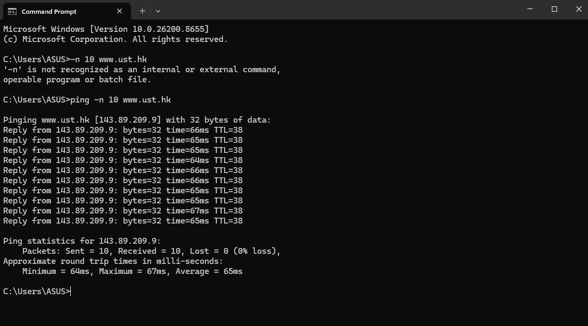
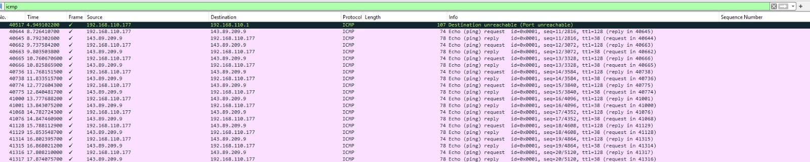
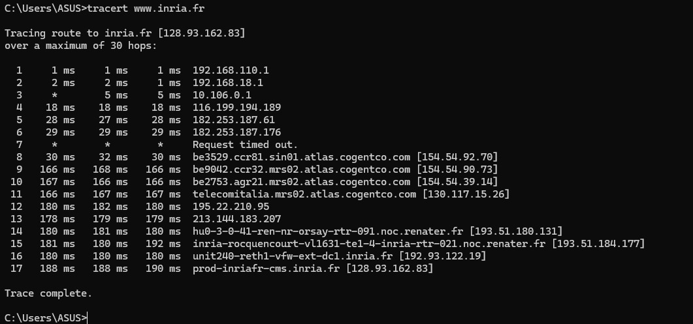
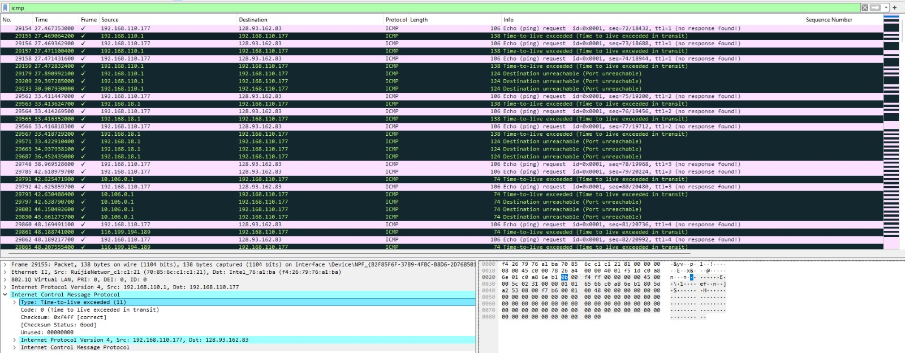

# Laporan Praktikum Jaringan Komputer

## Modul 12 – ICMP dan Asistensi Tugas Besar

**Nama:** EFRAN GUSTINE YULIANTO  
**NIM:** 103072400046  

## Tujuan
Menganalisis mekanisme operasional protokol ICMP (*Internet Control Message Protocol*) menggunakan Wireshark melalui peninjauan terhadap aktivitas paket data *Ping* serta *Traceroute*.

## Langkah Praktikum

### A. Pengamatan ICMP melalui Utilitas Ping
1. Mengaktifkan perangkat lunak Wireshark pada komputer.
2. Menentukan *interface* jaringan lokal yang berstatus aktif/terhubung.
3. Memulai proses penangkapan (*capture*) lalu lintas paket data jaringan.
4. Membuka jendela Command Prompt (CMD).
5. Jalankan perintah: ping -n 10 www.ust.hk
6. Menghentikan proses perekaman aktivitas paket pada Wireshark.
7. Menerapkan parameter penyaringan khusus dengan mengetikkan icmp pada kolom filter.
8. Mengamati dan mencatat karakteristik dari paket *ICMP Echo Request* dan *ICMP Echo Reply*.

### B. Pengamatan ICMP melalui Utilitas Traceroute
1. Menjalankan kembali sesi perekaman paket data yang baru (*new capture*) pada Wireshark.
2. Mengakses kembali jendela Command Prompt.
3. Jalankan perintah: tracert www.inria.fr
4. Menghentikan pemantauan data di Wireshark setelah seluruh proses pelacakan selesai.
5. Memasang kembali sintaks filter icmp pada kolom pencarian Wireshark.
6. Mengidentifikasi variasi tipe pesan ICMP yang ditransmisikan sepanjang pengujian.
7. Menganalisis runtutan lompatan jaringan (*hop*) yang dilewati paket data untuk mencapai server target.

---

## Hasil Pengamatan

### Eksperimen Ping

#### Dokumentasi Eksekusi Perintah Ping

#### Dokumentasi Analisis Paket Ping pada Wireshark

### Eksperimen Traceroute

#### Dokumentasi Eksekusi Perintah Traceroute

#### Dokumentasi Analisis Paket Traceroute pada Wireshark

---

## Analisis

### 1. Karakteristik ICMP Echo Request dan Echo Reply
Berdasarkan log visualisasi paket yang ditangkap melalui Wireshark, jabarkan rincian parameter berikut secara detail:
- **Alamat IP Sumber (*Source IP*):** [Isi dengan IP perangkat Anda yang tertera di Wireshark]
- **Alamat IP Tujuan (*Destination IP*):** [Isi dengan IP target server www.ust.hk]
- **Nilai *Type* & *Code* ICMP:** [Isi nilai Type dan Code untuk Request serta Reply]
- **Round Trip Time (RTT):** [Isi rata-rata waktu respons kelancaran transmisi]
- **Rasio Pengiriman Paket:** [Isi ringkasan jumlah paket yang sukses terkirim dan diterima]

### 2. Penelusuran Jalur Traceroute
Berdasarkan visualisasi data yang dihasilkan oleh perintah pelacakan rute, uraikan informasi mengenai:
- Akumulasi total lompatan jaringan (*hop*) hingga paket tiba di titik akhir.
- Rincian alamat IP (*IP address*) dari setiap komponen *router* perantara yang dilewati.
- Pola bentuk respons atau status ICMP yang dikembalikan oleh masing-masing *hop* (misalnya pesan *Time Exceeded*).
- Kalkulasi durasi waktu tempuh (*latency*) yang dibutuhkan untuk melewati setiap jembatan jaringan.

---

## Kesimpulan

Berdasarkan rangkaian pengujian yang telah diselesaikan, dapat disimpulkan bahwa protokol ICMP memegang peranan krusial sebagai media diagnostik, pelaporan kesalahan, dan pengelolaan kondisi operasional di dalam jaringan komputer. 

Utilitas *Ping* mengandalkan kombinasi pesan *Echo Request* dan *Echo Reply* guna memvalidasi stabilitas konektivitas dasar antar-host secara dua arah. Sementara itu, prosedur *Traceroute* memanfaatkan batasan umur paket (*TTL/Time to Live*) dan umpan balik kesalahan dari perangkat *router* perantara untuk memetakan jalur logis, mengidentifikasi setiap *hop*, serta melacak rute perjalanan data hingga sampai ke lokasi tujuan akhir.