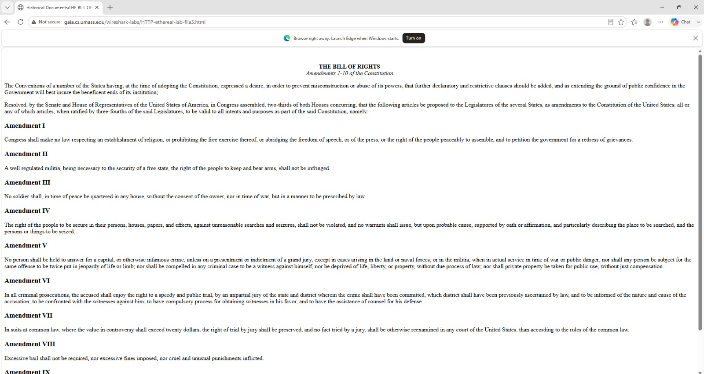
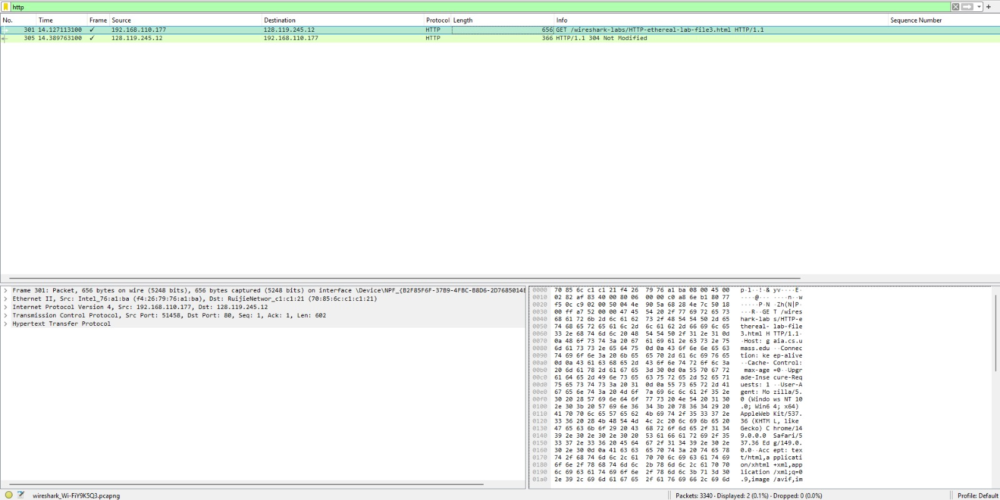
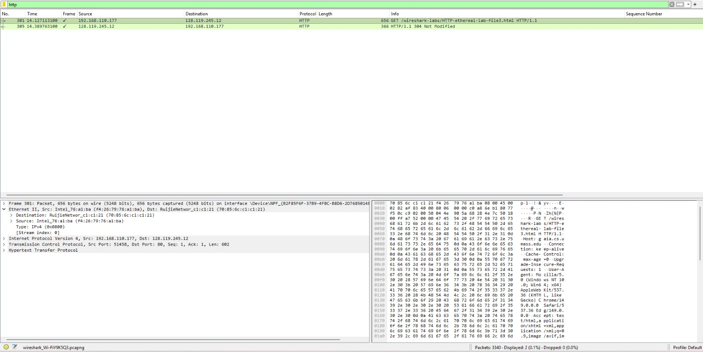
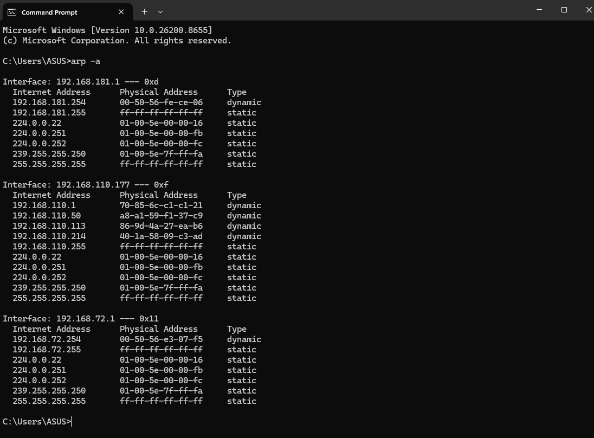
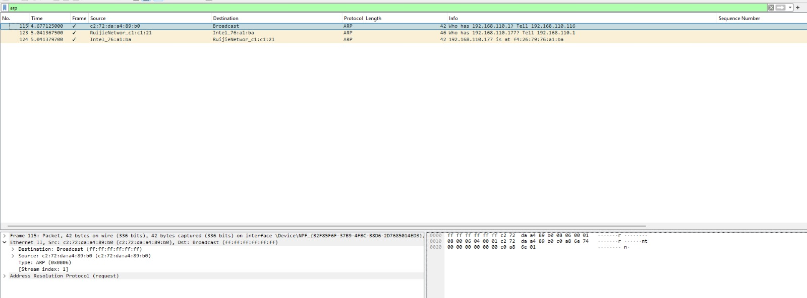

# Laporan Praktikum Jaringan Komputer

## Modul 13 – Ethernet dan ARP

**Nama:** EFRAN GUSTINE YULIANTO  
**NIM:** 103072400046  

## Langkah Percobaan

### A. Perekaman dan Analisis Frame Ethernet
1. Menjalankan perangkat lunak Wireshark pada perangkat komputer.
2. Memulai proses pemantauan paket data (*packet capture*) pada *interface* jaringan yang berstatus aktif.
3. Membuka aplikasi *web browser* dan mengakses tautan berikut: http://gaia.cs.umass.edu/wireshark-labs/HTTP-wireshark-file3.html
4. Menghentikan aktivitas perekaman data di Wireshark segera setelah halaman web termuat secara sempurna.
5. Menerapkan instruksi penyaringan dengan memasukkan kata kunci `http` pada kolom filter Wireshark.
6. Mengidentifikasi paket data berjenis *HTTP GET*, kemudian menganalisis rincian informasi struktural *Ethernet Frame* yang melekat pada paket tersebut.

### B. Pemeriksaan dan Manajemen Tabel ARP Cache
1. Mengakses dan membuka jendela Command Prompt (CMD).
2. Mengeksekusi instruksi jaringan: arp -a
3. Mengamati dan meninjau daftar pemetaan alamat yang tersimpan di dalam tabel *ARP Cache*.
4. Membersihkan seluruh data riwayat pemetaan dengan menjalankan perintah: arp -d *
5. Menjalankan kembali perintah: arp -a
6. Melakukan verifikasi akhir guna memastikan bahwa seluruh data *ARP Cache* telah berhasil dikosongkan atau diperbarui.

### C. Peninjauan Terhadap Siklus Protokol ARP
1. Mengaktifkan kembali sesi perekaman lalu lintas paket data yang baru pada aplikasi Wireshark.
2. Memasang sintaks penyaringan dengan kata kunci `arp` pada kolom filter pencarian.
3. Memicu terbentuknya lalu lintas data baru di jaringan dengan cara berinteraksi atau mengakses *host* lain dalam satu segmen jaringan lokal.
4. Mengamati karakteristik kemunculan paket data *ARP Request* dan *ARP Reply* pada panel Wireshark.
5. Membedah dan menganalisis informasi penting di dalam paket, yang mencakup *Source MAC Address*, *Destination MAC Address*, *Source IP Address*, serta *Target IP Address*.

---

## Analisis

### 1. Struktur Ethernet Frame
Berdasarkan hasil analisis terhadap paket *HTTP GET* pada Wireshark, struktur *Ethernet Frame* (khususnya Ethernet II) memuat informasi alamat fisik perangkat, yaitu *Source MAC Address* (alamat pengirim) dan *Destination MAC Address* (alamat tujuan). Selain itu, terdapat kolom *Type* yang mengindikasikan jenis protokol lapisan atas yang diwadahi oleh frame tersebut, seperti IPv4 (`0x0800`).

### 2. Mekanisme Kerja dan Karakteristik ARP
Protokol ARP (*Address Resolution Protocol*) beroperasi pada lapisan data link untuk menjembatani komunikasi dengan memetakan alamat logika (IP Address) ke alamat fisik (MAC Address). 
- **ARP Cache:** Berfungsi menyimpan tabel pemetaan IP-MAC sementara agar perangkat tidak perlu melakukan *broadcasting* terus-menerus. Perintah `arp -d *` terbukti efektif untuk mengosongkan tabel ini guna memperbarui rute fisik jaringan.
- **ARP Request & Reply:** Ketika tabel *cache* kosong, perangkat akan mengirimkan paket *ARP Request* secara *broadcast* (ditujukan ke semua perangkat) untuk mencari tahu pemilik IP target. Perangkat yang memiliki IP tersebut kemudian membalas secara *unicast* melalui paket *ARP Reply* yang berisi informasi MAC Address miliknya.

---

## Kesimpulan

* Ethernet bertindak sebagai protokol lapisan data link yang bertanggung jawab dalam membungkus paket data menjadi *frame* serta mengelola pengiriman data antardua perangkat berbasis alamat fisik (MAC Address).
* Protokol ARP memegang peranan krusial dalam menyelaraskan dan memetakan hubungan antara *IP Address* (Layer 3) dengan *MAC Address* (Layer 2) di dalam jaringan lokal.
* Proses pencarian alamat fisik dilakukan melalui komunikasi dua arah terstruktur, yaitu interaksi *ARP Request* yang bersifat *broadcast* dan *ARP Reply* yang bersifat *unicast*.
* Manajemen *ARP Cache* melalui sistem operasi sangat penting untuk memastikan akurasi data pemetaan, mempercepat efisiensi transmisi, serta meminimalkan terjadinya gangguan komunikasi akibat adanya perubahan perangkat keras di dalam jaringan.