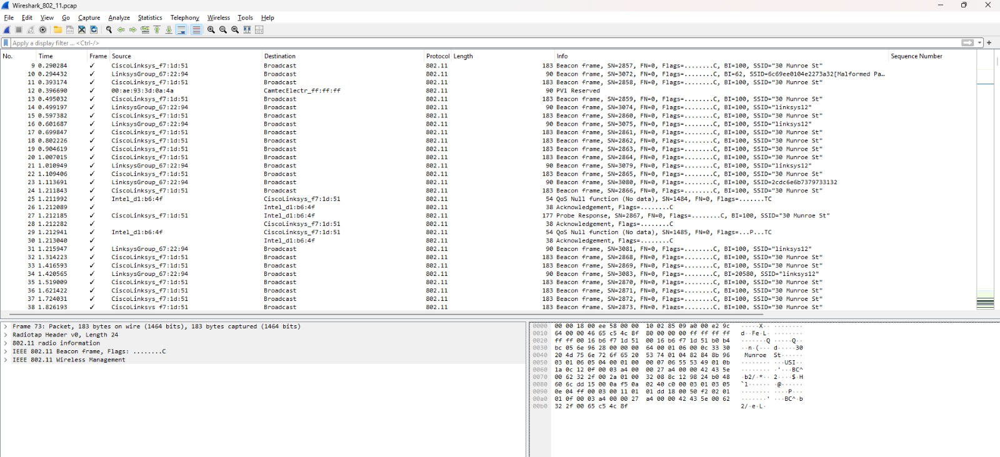
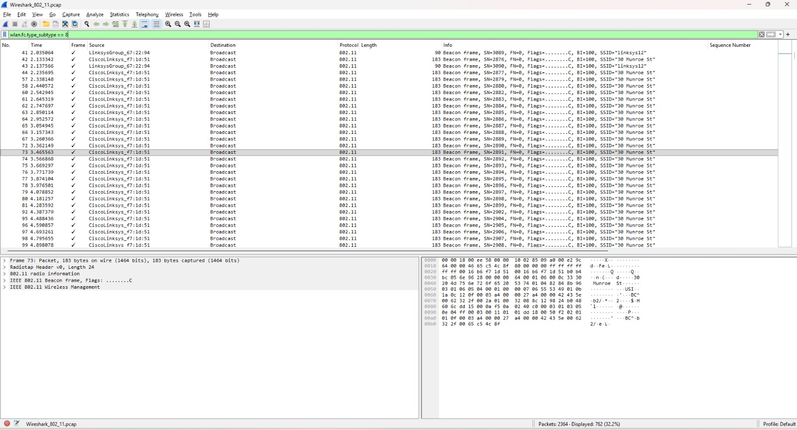
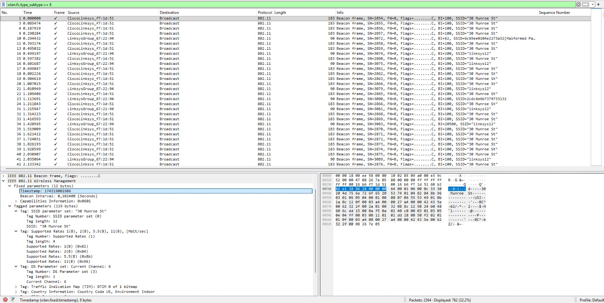
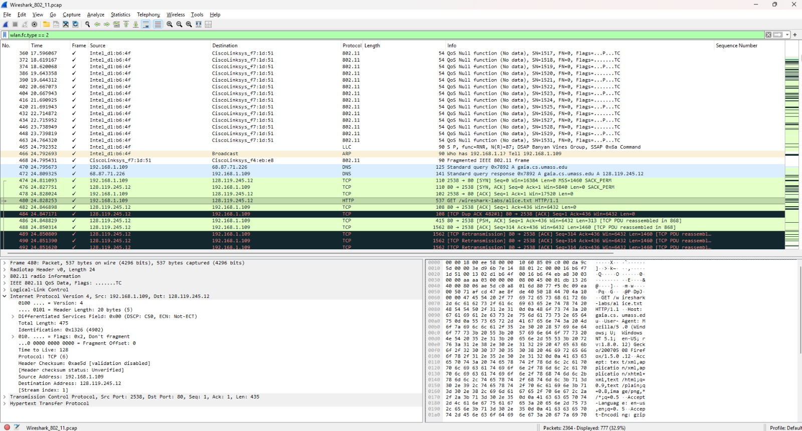
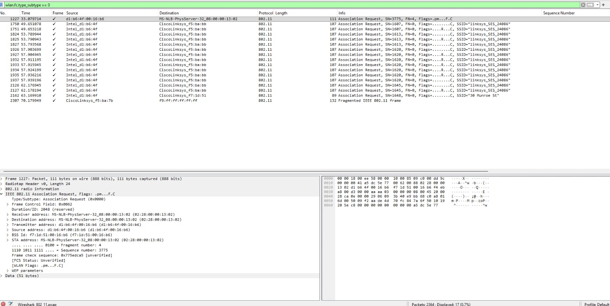
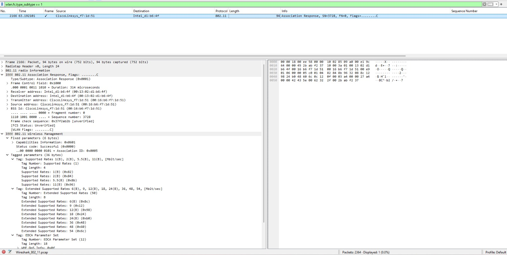

# Laporan Praktikum Jaringan Komputer

## Modul 14 – 802.11 WiFi

**Nama:** EFRAN GUSTINE YULIANTO 
**NIM:** 103072400046

## Tujuan
Menyelidiki, menganalisis, dan memahami karakteristik serta mekanisme operasional dari protokol jaringan nirkabel (*wireless*) berbasis standar IEEE 802.11 (WiFi) melalui pemantauan paket data menggunakan Wireshark.

## Langkah Praktikum

### A. Penelaahan Berkas Log (*Capture*) Aktivitas WiFi
1. Menjalankan perangkat lunak Wireshark pada komputer.
2. Membuka berkas log jaringan nirkabel yang telah disediakan oleh asisten praktikum (`Wireshark_802_11.pcap` atau nama berkas sejenis).
3. Menijnau daftar paket data nirkabel yang terekam di dalam berkas tersebut.
4. Mengidentifikasi alamat fisik perangkat *Access Point* (AP) beserta jajaran perangkat *client* yang saling berinteraksi.

### B. Bedah Struktur Paket Beacon Frame
1. Melakukan pelacakan terhadap jenis paket manajemen jaringan berupa *Beacon Frame*.
2. Memilih salah satu sampel paket *Beacon Frame* untuk diperiksa secara mendalam.
3. Meneliti parameter-parameter penting yang tertera, meliputi:
   - SSID (*Service Set Identifier*)
   - BSSID (*Basic Service Set Identifier*)
   - *Channel* (saluran frekuensi) yang digunakan
   - *Supported Rates* (kapabilitas kecepatan data)
   - *Capability Information* (fitur penunjang keamanan dan teknis AP)

### C. Analisis Alur Transmisi Data (*Data Transfer*)
1. Menyaring dan mencari paket-paket data yang merepresentasikan aktivitas pertukaran informasi.
2. Memetakan alur komunikasi logis yang terjalin antara perangkat *client* dengan *Access Point*.
3. Mengamati kesesuaian alamat fisik berupa *Source MAC Address* dan *Destination MAC Address*.
4. Mengidentifikasi jejak paket yang berkaitan langsung dengan proses pengaksesan halaman situs web.

### D. Penelusuran Fase Association dan Disassociation
1. Melacak keberadaan paket *Association Request* yang dikirimkan oleh *client*.
2. Melacak paket balasan berupa *Association Response* dari pihak *Access Point*.
3. Menganalisis tahapan logis saat *client* mengajukan izin untuk bergabung ke dalam jaringan AP.
4. Mengidentifikasi keberadaan paket *Disassociation* (pemutusan koneksi) jika terekam di dalam log.
5. Memetakan siklus utuh penyambungan hingga pelepasan hubungan konektivitas pada jaringan WiFi.

---

## Hasil Pengamatan

### Tampilan Awal Capture WiFi

### Rekaman Beacon Frame

### Rincian Parameter Beacon Frame

### Lalu Lintas Data Transfer

### Aktivitas Association Request

### Tanggapan Association Response

---

## Analisis

### 1. Karakteristik Deskriptif Beacon Frame
Berdasarkan sampel *Beacon Frame* yang telah dibedah melalui Wireshark, silakan lakukan analisis data mengenai poin-poin parameter berikut:
- **SSID Jaringan:** [Isi dengan nama WiFi/SSID yang terdeteksi]
- **BSSID Access Point:** [Isi dengan MAC Address dari AP pengirim Beacon]
- **Alokasi Frekuensi / Channel:** [Isi nomor channel frekuensi yang dipakai AP]
- **Capability Information:** [Isi informasi kapabilitas seperti enkripsi WPA/WEP atau fitur ESS/IBSS]
- **Struktur Informasi Broadcast:** Menelaah bagaimana AP menyiarkan parameter internalnya secara berkala guna mengumumkan eksistensinya kepada seluruh *client* di sekitar jangkauan sinyal.

### 2. Evaluasi Transmisi Data Nirkabel
Berdasarkan paket *Data Frame* yang dianalisis, uraikan hasil peninjauan mengenai:
- Identitas fisik pengirim (*Source MAC Address*) dan penerima (*Destination MAC Address*).
- Klasifikasi jenis *frame* yang digunakan khusus untuk mengangkut beban data (*payload*).
- Dinamika aktivitas komunikasi antara *client* dan AP saat melakukan proses *browsing* atau pertukaran data Layer 3 ke atas.

### 3. Pemetaan Logika Koneksi (Association & Disassociation)
Uraikan kronologi proses manajemen konektivitas nirkabel berdasarkan paket yang ditemukan:
- **Prosedur Inisiasi Koneksi:** Analisis langkah awal *client* memohon autentikasi dan registrasi fisik ke AP melalui *Association Request*.
- **Prosedur Validasi Hubungan:** Analisis keputusan pemberian hak akses oleh AP yang tertuang di dalam paket *Association Response* (apakah statusnya *Success* atau *Fail*).
- **Mekanisme Terminasi Jalur:** Analisis pemicu dan struktur paket *Disassociation Frame* ketika hubungan jaringan diputus, baik atas permintaan *client* maupun intervensi dari sisi *Access Point*.

---

## Kesimpulan

Berdasarkan serangkaian tahapan praktikum yang telah dilaksanakan, dapat disimpulkan bahwa standar protokol IEEE 802.11 mengimplementasikan pembagian jenis *frame* yang sangat terstruktur (Management, Control, dan Data Frame) demi menjamin kelancaran tata kelola koneksi nirkabel. 

*Beacon Frame* memegang peranan krusial sebagai instrumen penyiaran identitas dan kapabilitas teknis dari *Access Point* agar dapat dideteksi oleh perangkat luar. Proses penyambungan perangkat ke jaringan nirkabel dipandu secara ketat oleh interaksi *Association Request* dan *Response* guna memvalidasi kecocokan parameter sebelum pertukaran data diizinkan. Terakhir, *Data Frame* bertindak sebagai kontainer utama yang bertugas mengemas dan mengantarkan informasi pengguna melintasi media udara dengan aman dan efisien.