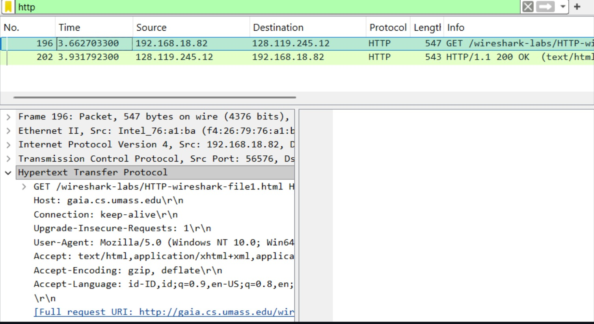
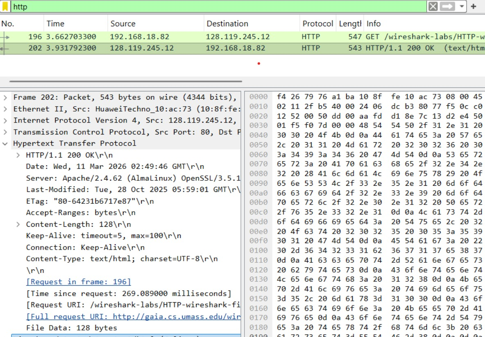
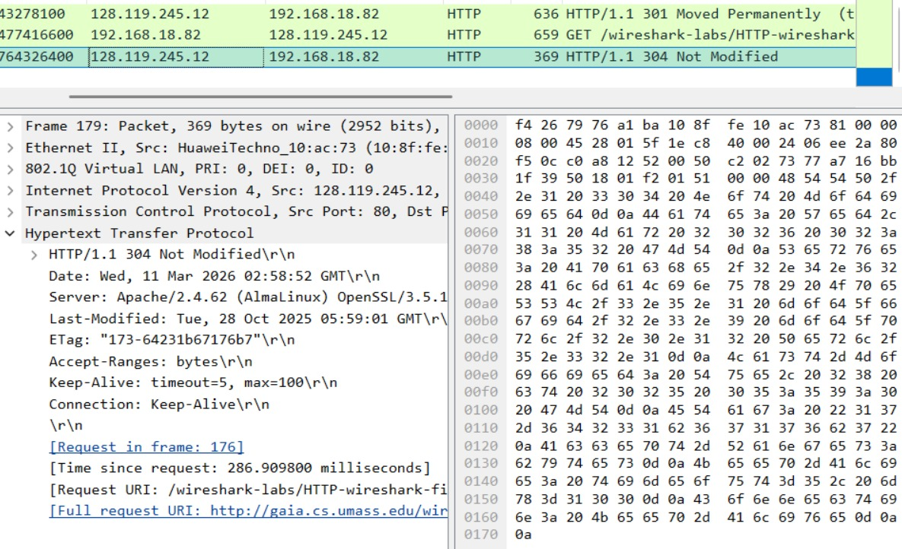
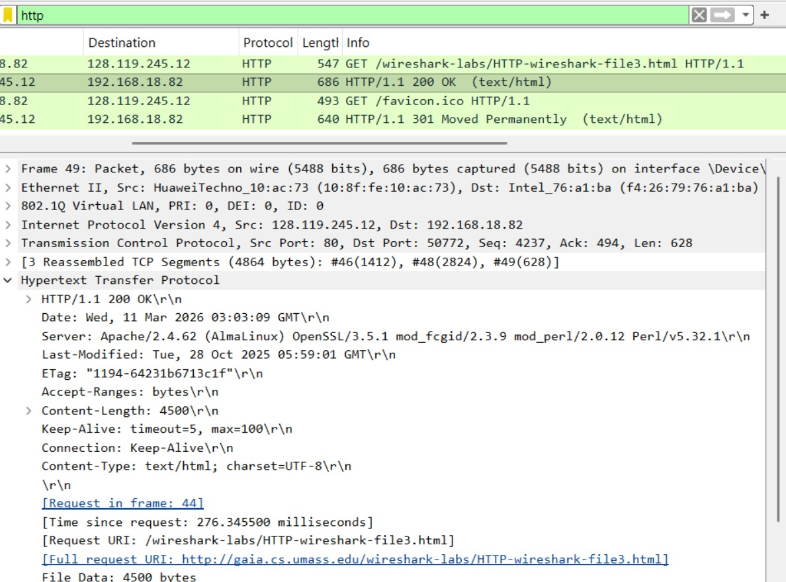
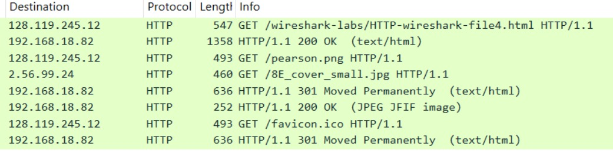
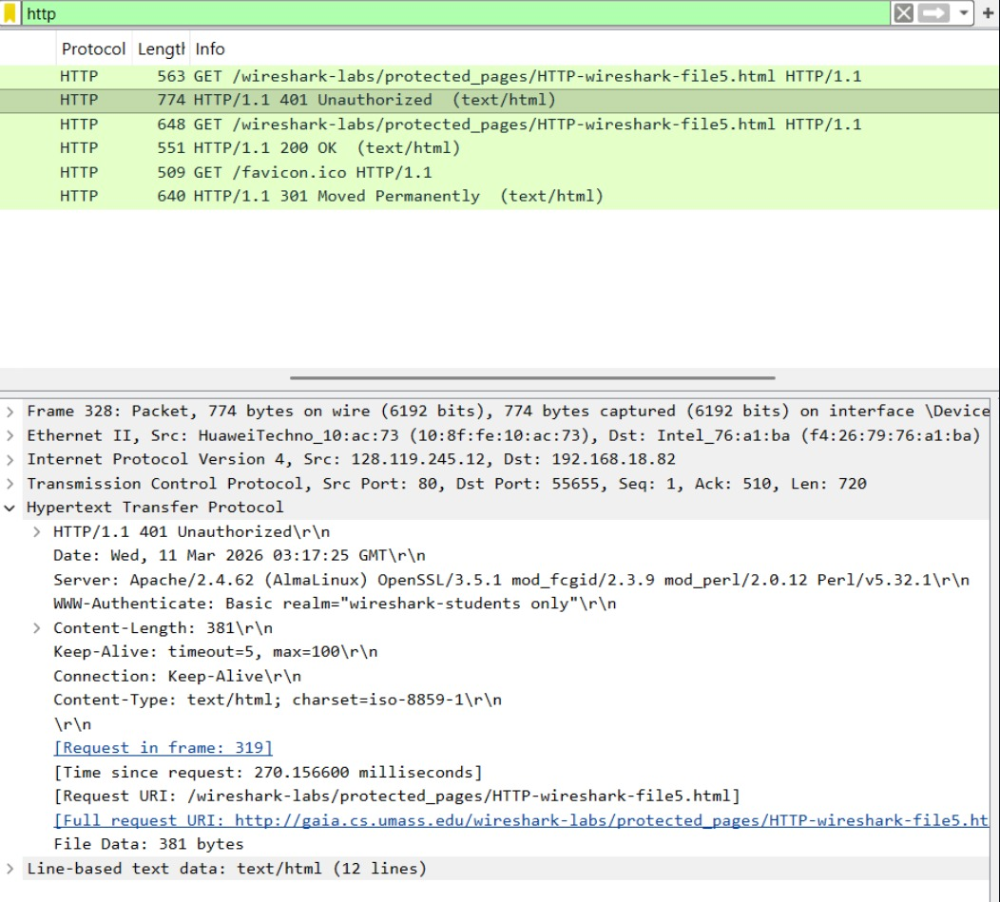

# Laporan Praktikum Jaringan Komputer - Modul 3: HTTP
**Nama:** Efran Gustine Yulianto  
**NIM:** 103072400046  
**Kelas:** IF-04-02  

---

## Tujuan Praktikum
Menganalisis mekanisme protokol **HTTP (Hypertext Transfer Protocol)** dalam komunikasi antara *client* (browser) dan *server* dengan bantuan tools **Wireshark**.

## Hasil Analisis Percobaan

### 1. Basic HTTP GET / Response
**Skenario:** Mengakses file HTML sederhana untuk melihat struktur dasar request dan response.
* **Analisis:** Terdeteksi dua paket utama dalam transmisi data. 
    * **HTTP GET:** Browser menginisiasi permintaan ke server untuk file `/wireshark-labs/HTTP-wireshark-file1.html`.
    * **HTTP Response:** Server memberikan feedback berupa status code `200 OK` yang menandakan resource tersedia dan berhasil dikirim.

### 2. HTTP Conditional GET
**Skenario:** Melakukan *refresh* halaman untuk menguji mekanisme *caching*.
* **Analisis:** Browser mengirimkan header `If-Modified-Since`. Jika konten di server belum berubah sejak waktu yang ditentukan, server akan merespons dengan status code `304 Not Modified`. Mekanisme ini krusial untuk optimasi penggunaan *bandwidth*.

### 3. Retrieving Long Documents
**Skenario:** Mengambil file HTML dengan ukuran data yang besar.
* **Analisis:** Karena keterbatasan ukuran payload pada layer transport, file HTML yang besar dipecah menjadi beberapa **TCP Segments**.
* **Temuan Wireshark:** Terlihat keterangan `[3 Reassembled TCP Segments]`. Hal ini menunjukkan bahwa Wireshark berhasil menyatukan kembali (*reassembly*) fragmentasi paket TCP menjadi satu pesan HTTP utuh pada layer aplikasi.

### 4. HTML dengan Embedded Objects
**Skenario:** Mengakses halaman web yang mengandung elemen multimedia (gambar).
* **Analisis:** Protokol HTTP bekerja secara spesifik untuk setiap objek. Browser melakukan beberapa permintaan GET secara terpisah untuk:
    * File HTML utama.
    * Aset gambar (`pearson.png`, `8E_cover_small.jpg`).
    * Ikon situs (`favicon.ico`).

### 5. HTTP Authentication
**Skenario:** Mengakses halaman yang diproteksi oleh kata sandi.
* **Analisis:** 1. Awalnya server menolak akses dengan respons `401 Unauthorized`.
    2. Setelah kredensial dimasukkan, browser mengirimkan header `Authorization: Basic`.
    3. **Catatan Keamanan:** Data kredensial dikirim menggunakan encoding **Base64**. Karena tidak terenkripsi, metode ini rentan terhadap *interception* jika tidak berjalan di atas protokol HTTPS.

---

## 📝 Kesimpulan
1. **Request-Response Cycle:** Komunikasi web berpusat pada permintaan client (GET) dan tanggapan server.
2. **Efisiensi:** Fitur *Conditional GET* membantu meminimalisir redundansi pengiriman data.
3. **Transportasi Data:** HTTP sangat bergantung pada layer TCP untuk menangani fragmentasi data dalam jumlah besar.
4. **Security:** Autentikasi HTTP dasar (Basic Auth) hanya melakukan pengkodean teks (encoding), bukan enkripsi, sehingga memerlukan layer tambahan seperti TLS/SSL untuk keamanan maksimal.

## Lampiran 
Hasil Percobaan:

