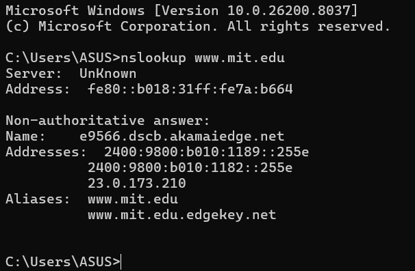
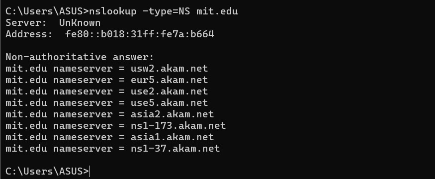
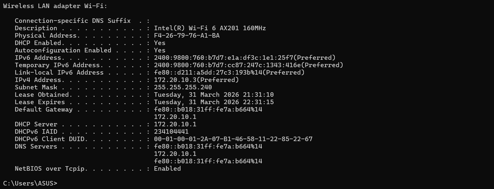
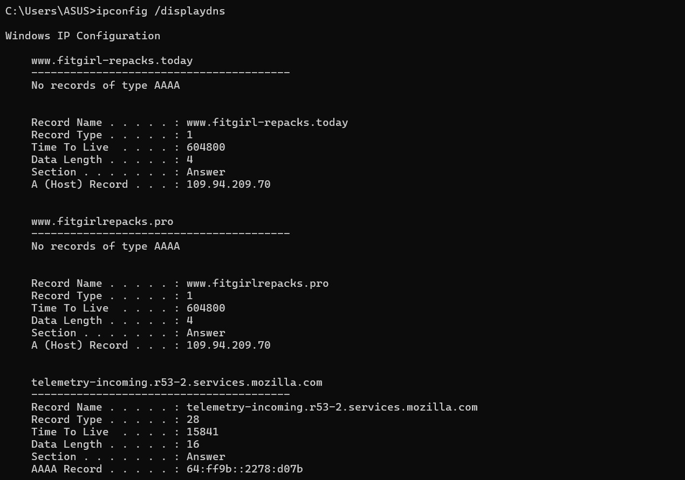
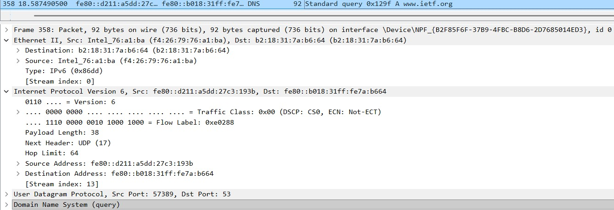
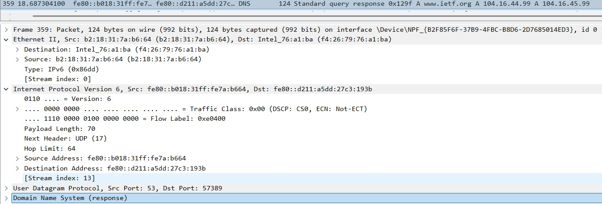
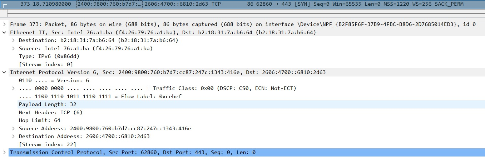

# Laporan Praktikum Jaringan Komputer - Modul 4: DNS
**Nama:** Efran Gustine Yulianto  
**NIM:** 103072400065  
**Kelas:** IF-04-02  

---

## Tujuan Praktikum
Memahami mekanisme kerja **Domain Name System (DNS)** dan melakukan investigasi protokol melalui tools navigasi jaringan seperti `nslookup`, `ipconfig`, serta analisis paket menggunakan **Wireshark**.

## Dasar Teori
DNS merupakan sistem basis data terdistribusi yang berfungsi menerjemahkan nama domain (*human-readable*) menjadi alamat IP (*machine-readable*). Proses ini adalah langkah fundamental yang terjadi di layer aplikasi sebelum komunikasi antar-host dimulai di internet.

## Hasil Analisis Percobaan

### 1. Eksplorasi Nslookup
* **Pencarian Alamat IP:** Melalui perintah `nslookup www.mit.edu`, diperoleh pemetaan alamat IP publik dari domain tersebut serta identitas DNS server yang menangani kueri.

* **NS Record:** Dengan perintah `nslookup -type=NS mit.edu`, teridentifikasi daftar *Authoritative Name Servers* yang bertanggung jawab penuh atas manajemen zona domain MIT.

### 2. Konfigurasi Host & DNS Cache (`ipconfig`)
* **Network Info:** Perintah `ipconfig /all` digunakan untuk memverifikasi alamat IPv4 perangkat dan mengidentifikasi *DNS Resolver* yang dikonfigurasi pada sistem.

* **DNS Cache:** Melalui `ipconfig /displaydns`, terlihat daftar domain yang pernah diakses. Cache ini berfungsi mempercepat resolusi nama dengan memangkas waktu kueri berulang ke server eksternal.

### 3. Analisis Traffic DNS (Wireshark Capture)
**Skenario:** Analisis kueri domain `www.ietf.org`.
* **DNS Request:** Terdeteksi sebagai *Standard Query A*, di mana client mengirimkan pertanyaan ke server DNS.
* **DNS Response:** Server membalas dengan alamat IP tujuan (misal: `104.16.44.99`). 
* **Identifikasi:** Kesesuaian antara Request dan Response dipastikan melalui **Transaction ID** yang identik (contoh: `0x129f`), menjamin bahwa respons tersebut valid untuk permintaan yang dikirimkan.

### 4. Korelasi DNS dan Koneksi TCP
**Skenario:** Filter `tcp.flags.syn == 1`.
* **Analisis:** Setelah DNS Response diterima, client langsung menginisiasi **TCP Three-Way Handshake**.
* **Temuan:** Paket pertama yang muncul adalah flag `[SYN]` yang ditujukan ke alamat IP yang sebelumnya didapatkan dari proses DNS. Hal ini membuktikan bahwa DNS adalah prasyarat mutlak sebelum koneksi transport (TCP) dapat dibangun untuk layanan seperti HTTPS (port 443).

---

## Analisis & Jawaban Pertanyaan
1.  **Protokol Transport:** DNS umumnya beroperasi di atas protokol **UDP** untuk kecepatan kueri.
2.  **Port:** Menggunakan **Port 53**.
3.  **Isi Request:** DNS Request hanya berisi *Question section* (pertanyaan nama domain).
4.  **Isi Response:** DNS Response memuat *Answer section* yang berisi alamat IP atau data record lainnya.
5.  **Korelasi IP:** Alamat IP pada paket TCP **pasti sama** dengan IP hasil DNS response karena DNS berfungsi sebagai penunjuk jalan bagi paket TCP.

---

## Kesimpulan
Praktikum ini membuktikan bahwa DNS bertindak sebagai "buku telepon" internet. Tanpa resolusi DNS yang sukses, client tidak akan bisa mengetahui alamat tujuan untuk memulai proses *handshake* TCP. Observasi melalui Wireshark menunjukkan alur yang logis: **Resolusi Nama (DNS) -> Pembangunan Koneksi (TCP SYN) -> Pertukaran Data (HTTP/HTTPS).**