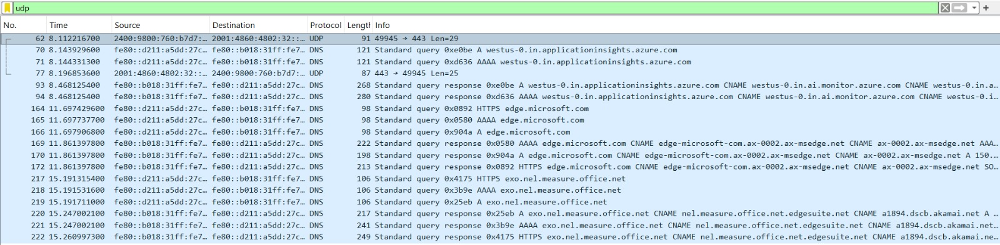
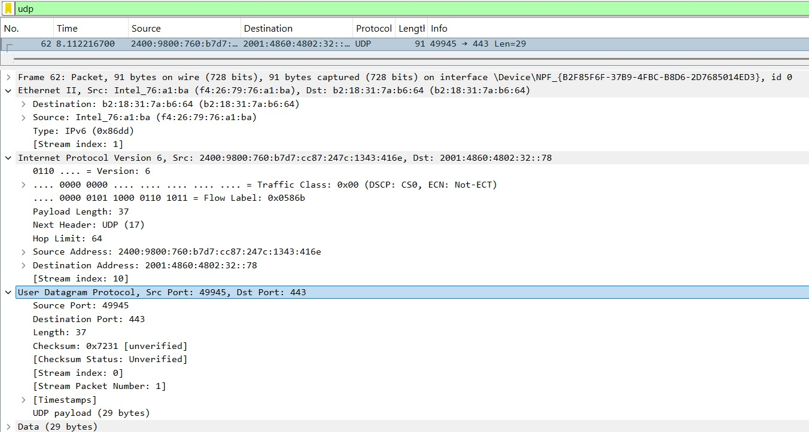
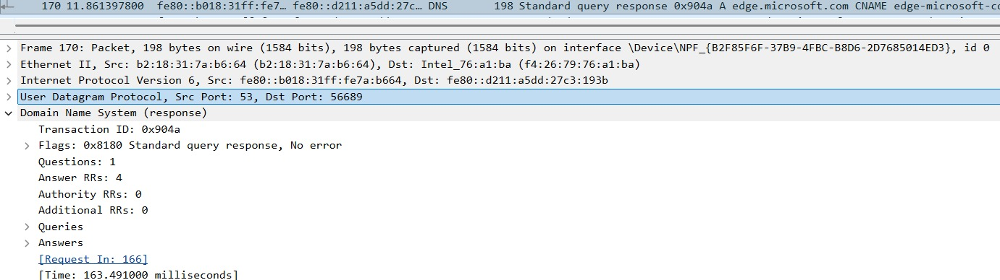

# Laporan Praktikum Jaringan Komputer - Modul 5: UDP
**Nama:** Efran Gustine Yulianto  
**NIM:** 103072400046  
**Kelas:** IF-04-02  

---

## Tujuan Praktikum
Melakukan investigasi mendalam terhadap karakteristik protokol **UDP (User Datagram Protocol)** melalui analisis paket data pada software Wireshark.

## Dasar Teori
UDP adalah protokol *transport layer* yang bersifat **connectionless**. Berbeda dengan TCP, UDP tidak melakukan proses *handshake*, tidak menjamin pengiriman data (*unreliable*), serta tidak memiliki kontrol kemacetan. Keunggulannya terletak pada minimnya *overhead* sehingga transmisi data menjadi sangat cepat, ideal untuk DNS, VoIP, dan protokol modern seperti **QUIC**.

## Hasil Analisis Percobaan

### 1. Capture Paket UDP
* **Analisis:** Setelah melakukan capture dengan filter `udp`, terlihat berbagai paket yang melintasi jaringan. 
* **Temuan:** Tidak ditemukan adanya paket kontrol seperti `SYN`, `ACK`, atau `FIN`. Hal ini membuktikan bahwa UDP langsung mengirimkan datagram ke tujuan tanpa memastikan apakah penerima siap atau tidak (*Best-effort delivery*).

### 2. Bedah Header UDP
Berdasarkan inspeksi pada layer transport di Wireshark, header UDP terlihat sangat ringkas (hanya 8 byte).
* **Komponen Header:**
    * **Source Port (49945):** Identitas port pengirim pada perangkat client.
    * **Destination Port (443):** Menunjukkan target layanan. Dalam kasus ini, port 443 (biasanya HTTPS) di atas UDP menandakan penggunaan protokol **QUIC/HTTP3**.
    * **Length (37):** Ukuran total datagram (Header + Data).
    * **Checksum:** Digunakan untuk verifikasi integritas paket secara terbatas.
* **Analisis:** Kesederhanaan struktur ini yang membuat UDP memiliki performa tinggi karena tidak perlu memproses nomor urut (*sequence number*) atau *window size* seperti pada TCP.

### 3. Implementasi UDP pada DNS
* **Analisis:** DNS secara default menggunakan UDP pada **Port 53**. 
* **Temuan Wireshark:** Pada paket *DNS Response*, terlihat status `No error` dengan `Answer RRs: 4`. 
* **Kesimpulan:** Penggunaan UDP pada DNS sangat krusial karena kueri DNS harus bersifat instan. Jika menggunakan TCP, proses *handshake* akan menambah *latency* yang memperlambat pemuatan halaman web.

---

## Analisis & Jawaban Pertanyaan
1.  **Connection-Oriented?** Tidak, UDP adalah protokol *connectionless*.
2.  **Handshake:** Tidak ada mekanisme jabat tangan (*handshake*) pada UDP.
3.  **Reliability:** Tidak. UDP tidak menjamin data sampai atau urutan data yang benar.
4.  **Alasan Kecepatan:** UDP lebih cepat karena tidak memiliki *overhead* administratif (tanpa retransmisi, tanpa kontrol aliran, dan tanpa pembangunan koneksi).
5.  **IP TCP vs DNS:** (Dari modul sebelumnya) IP tujuan pada TCP akan selalu merujuk pada hasil resolusi yang diberikan oleh UDP melalui protokol DNS.

---

## Kesimpulan
UDP adalah protokol "kirim dan lupakan" (*fire and forget*). Melalui praktikum ini, dapat disimpulkan bahwa meskipun UDP tidak menawarkan keandalan, perannya sangat vital untuk aplikasi yang mementingkan **kecepatan** dan **real-time** di atas akurasi mutlak, seperti DNS dan protokol HTTP/3 (QUIC) yang kini mulai mendominasi traffic internet modern.