# Laporan Praktikum Jaringan Komputer - Modul 6: Analisis Protokol TCP
**Nama:** Efran Gustine Yulianto  
**NIM:** 103072400046  
**Kelas:** IF-04-02  

---

## Objektif Praktikum
Praktikum ini bertujuan untuk menelaah perilaku operasional **Transmission Control Protocol (TCP)** melalui observasi langsung di jaringan. Fokus utama mencakup analisis proses *three-way handshake*, penomoran urutan data (*sequence number*), sistem validasi penerimaan (*acknowledgment*), serta manajemen trafik menggunakan Wireshark.

---

## Pelaksanaan Percobaan

### 6.2 Tahapan Capture Paket
1. Mengaktifkan Wireshark dan memilih interface Wi-Fi yang aktif untuk memantau lalu lintas data.
2. Mengakses portal lab melalui tautan resmi yang disediakan.
   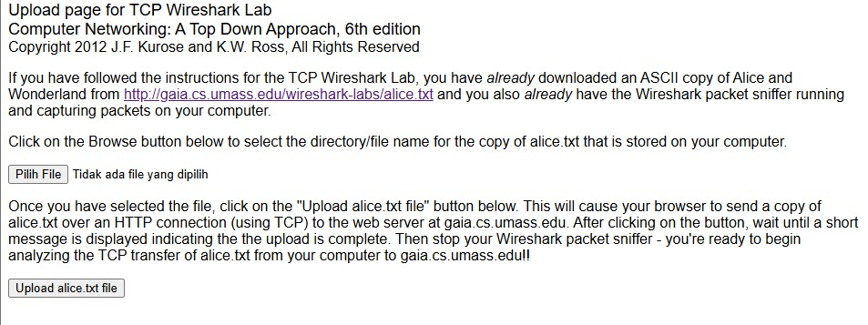
3. Mengunggah file **alice.txt** yang telah disiapkan ke server tujuan.
   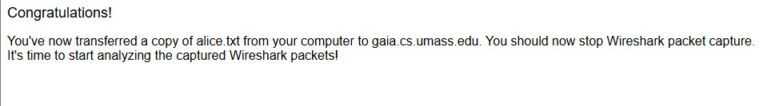
4. Mengakhiri sesi perekaman paket dan menerapkan display filter `tcp`.
   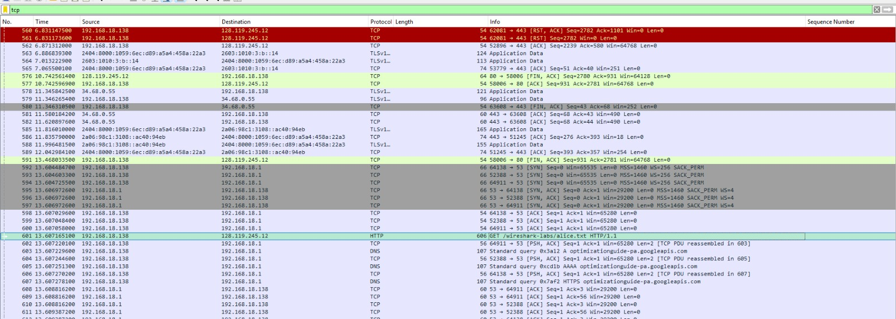

---

### 6.3 Investigasi Three-Way Handshake
Pada tahap awal, dilakukan identifikasi terhadap tiga paket utama yang membangun jalur koneksi *connection-oriented* antara klien dan server.
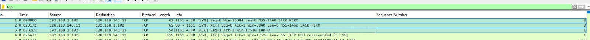

#### Analisis Parameter Jaringan:
* **IP Address Klien:** `192.168.1.102` (Port Transport: `1161`)
* **IP Address Server:** `128.119.245.12` (Port Transport: `80`)

#### Mekanisme Sinkronisasi:
* **SYN:** Inisiasi permintaan koneksi dari klien dengan `Sequence Number = 0`.
* **SYN-ACK:** Respon persetujuan dari server dengan `Seq = 0` dan `Ack = 1`.
* **ACK:** Konfirmasi akhir dari klien (`Ack = 1`) yang menandakan koneksi siap digunakan.

---

### 6.4 Bedah Struktural & Flow Control TCP

**1. Analisis Segmen SYN**
Segmen pembuka koneksi ditemukan pada paket pertama. Flag SYN yang aktif membuktikan dimulainya proses pembangunan jalur komunikasi.
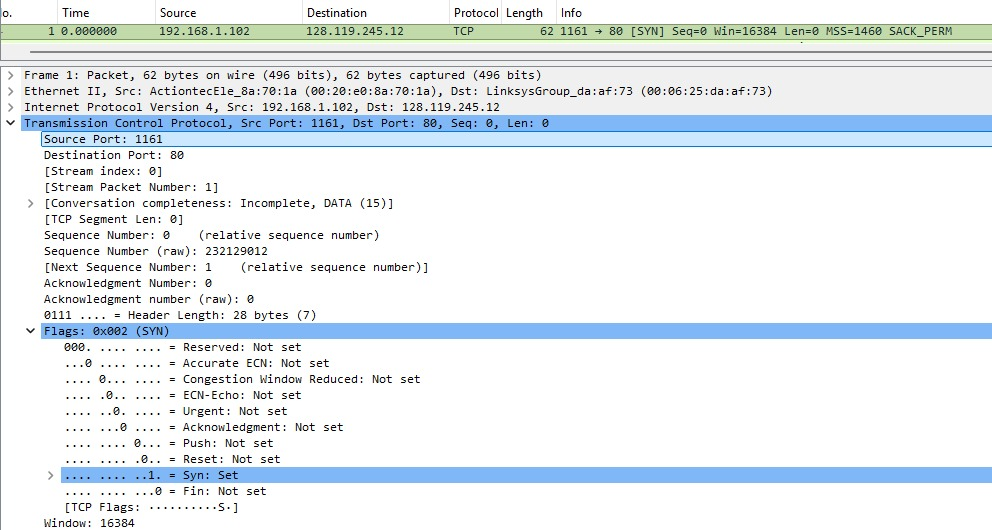

**2. Analisis Segmen SYN-ACK**
Server membalas dengan paket kedua (SYN-ACK). Nilai `Acknowledgment: 1` menunjukkan server telah sukses memproses permintaan dari klien.
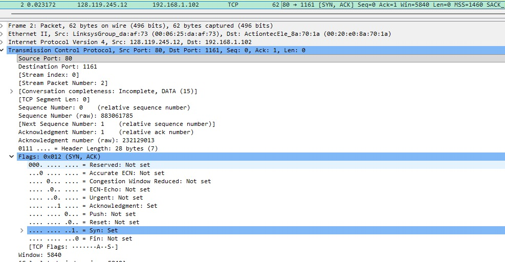

**3. Identifikasi Transmisi Data (HTTP POST)**
Unggahan file terdeteksi pada paket nomor 199. Instruksi POST ini dikirimkan dengan `Relative Sequence Number: 164041`.
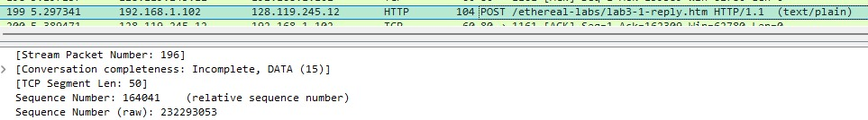

**4. Kontinuitas Penomoran Seq & Ack**
Teramati adanya peningkatan nilai *Acknowledgment* secara bertahap. Hal ini membuktikan bahwa TCP mampu mengonfirmasi setiap byte data yang diterima server secara sistematis.
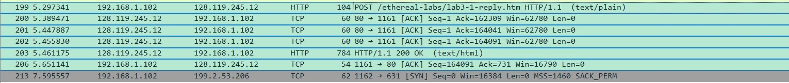

**5. Karakteristik Segmentasi (MSS)**
Besar paket yang bervariasi menunjukkan bahwa TCP melakukan fragmentasi data besar ke dalam beberapa segmen kecil agar selaras dengan kapasitas transmisi jaringan.
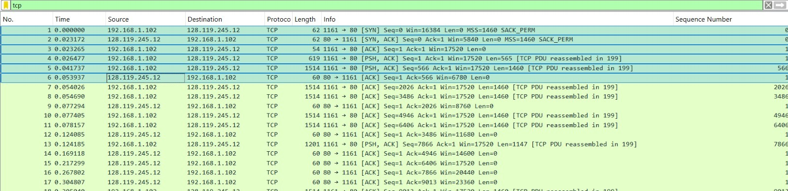

**6. Kapasitas Buffer (Window Size)**
Nilai *Window Size* yang stabil membuktikan bahwa buffer pada sisi penerima memadai untuk menampung traffic, sehingga tidak terjadi hambatan pengiriman.
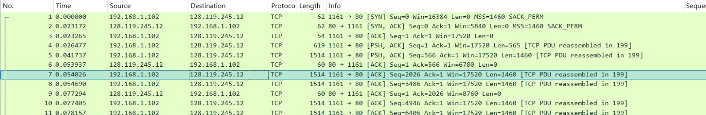

**7. Evaluasi Reliabilitas (Retransmission)**
Berdasarkan investigasi, tidak ditemukan adanya paket yang hilang atau dikirim ulang (*No Retransmission*), menandakan stabilitas link yang sangat baik.

---

### 6.5 Tinjauan Grafik Time-Sequence (Stevens)
Visualisasi grafik Stevens menunjukkan tren kenaikan *sequence number* yang konsisten, mencakup fase **slow start** menuju **congestion avoidance** yang berjalan stabil.
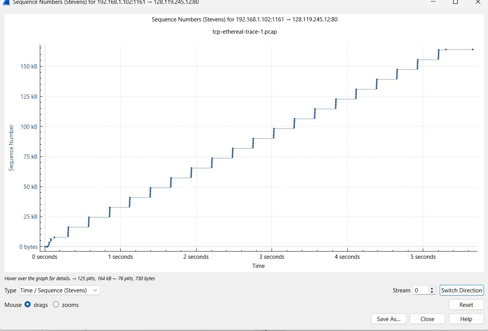

---

## Kesimpulan Akhir
Berdasarkan rangkaian observasi ini, dapat disimpulkan bahwa protokol TCP sangat andal dalam menangani transmisi data. Melalui sistem *handshake* yang presisi serta kontrol aliran (*flow control*), TCP memastikan seluruh isi file sampai ke tujuan secara sempurna tanpa ada data yang tercecer.