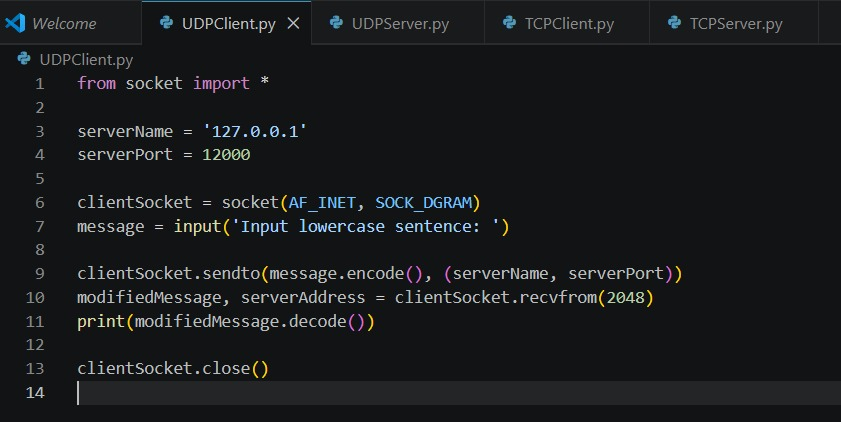
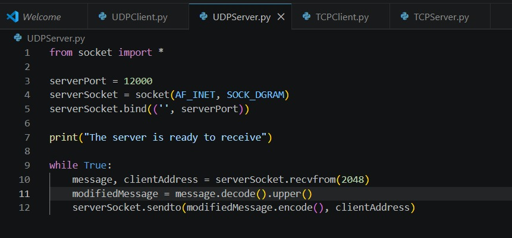
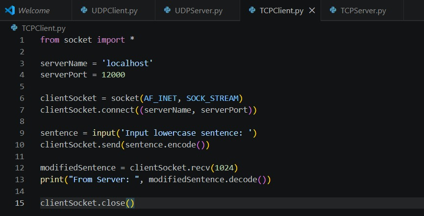
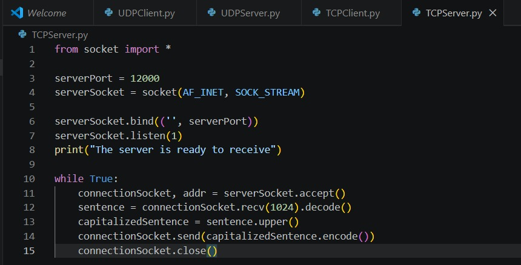
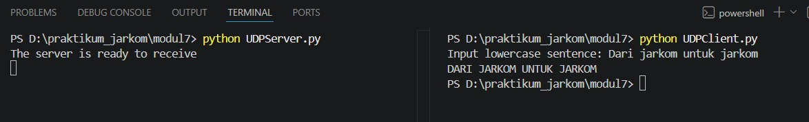

# Laporan Praktikum Jaringan Komputer - Modul 7: Socket Programming
**Nama:** Efran Gustine Yulianto  
**NIM:** 103072400046  
**Kelas:** IF-04-02  

---

## Tujuan Praktikum
Memahami konsep dasar komunikasi *client-server* melalui implementasi *socket programming*. Praktikum ini berfokus pada penggunaan protokol **UDP** dan **TCP** untuk membangun aplikasi sederhana yang mampu melakukan pertukaran data secara dua arah.

---

## Implementasi Kode Program

### 1. UDPClient.py
Skrip `UDPClient.py` bertindak sebagai entitas klien yang menggunakan protokol **UDP (User Datagram Protocol)**. Karakteristik utama UDP yang bersifat *connectionless* diimplementasikan di sini, di mana klien mengirimkan datagram ke server tanpa perlu melakukan prosedur *handshaking* terlebih dahulu. Data input dari pengguna dikonversi menjadi *byte stream* menggunakan metode `.encode()` sebelum ditransmisikan melalui *socket* menuju alamat IP dan port tujuan.

### 2. UDPServer.py
Skrip `UDPServer.py` berperan sebagai penyedia layanan yang selalu siaga (*listening*) pada port tertentu (12000). Menggunakan loop `while True`, server menerima paket data dari klien, memproses teks tersebut menjadi huruf kapital menggunakan fungsi `.upper()`, dan langsung mengirimkannya kembali ke alamat asal klien (*clientAddress*). Karena sifat UDP yang tidak memiliki status koneksi, server ini dapat menangani kiriman data secara cepat tanpa memelihara status sesi.

### 3. TCPClient.py
Berbeda dengan versi UDP, `TCPClient.py` mengimplementasikan protokol **TCP (Transmission Control Protocol)** yang bersifat *connection-oriented*. Sebelum pengiriman data dilakukan, klien wajib menjalankan fungsi `.connect()` untuk membangun sirkuit virtual dengan server. Mekanisme ini menjamin bahwa jalur komunikasi telah siap, sehingga data yang dikirimkan memiliki kepastian sampai ke tujuan secara urut dan utuh.

### 4. TCPServer.py
Pada sisi server TCP, skrip `TCPServer.py` menggunakan metode `.listen()` dan `.accept()` untuk mengelola permintaan koneksi yang masuk. Setiap kali ada klien yang terhubung, server akan membuat *connection socket* khusus untuk menangani klien tersebut. Setelah data diproses dan dikirim balik, koneksi khusus tersebut ditutup dengan `.close()`, namun server utama tetap berjalan untuk menunggu koneksi baru lainnya.

---

## Hasil Pengujian (Terminal Output)

### A. Pengujian Protokol UDP
Pada pengujian UDP, terlihat bahwa komunikasi berlangsung secara instan. Klien mengirimkan string dalam huruf kecil dan langsung mendapatkan balasan huruf kapital dari server tanpa adanya latensi pembangunan koneksi.

### B. Pengujian Protokol TCP
Pada pengujian TCP, proses pertukaran data diawali dengan pembangunan sesi. Hasil terminal menunjukkan keberhasilan transmisi data yang lebih terstruktur, di mana setiap pesan yang masuk diproses dan dikembalikan melalui jalur koneksi yang telah divalidasi.

---

## Kesimpulan
Melalui praktikum *socket programming* ini, dapat disimpulkan bahwa pemilihan protokol transport sangat bergantung pada kebutuhan aplikasi. **UDP** menawarkan efisiensi dan kecepatan karena tidak memiliki *overhead* koneksi, namun tidak memberikan jaminan reliabilitas. Sebaliknya, **TCP** menyediakan layanan komunikasi yang sangat andal dan terstruktur melalui mekanisme *connection-oriented*, yang memastikan integritas data tetap terjaga selama proses pengiriman di jaringan.