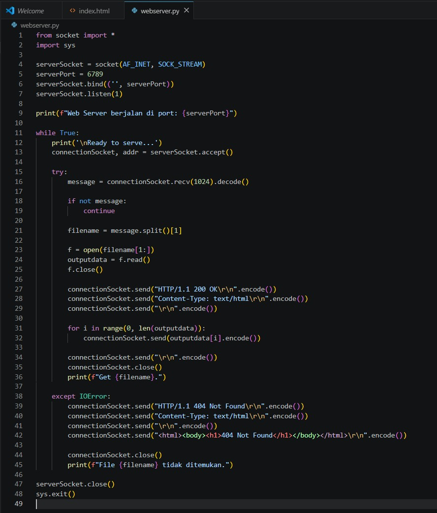
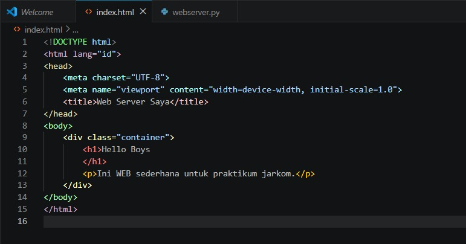
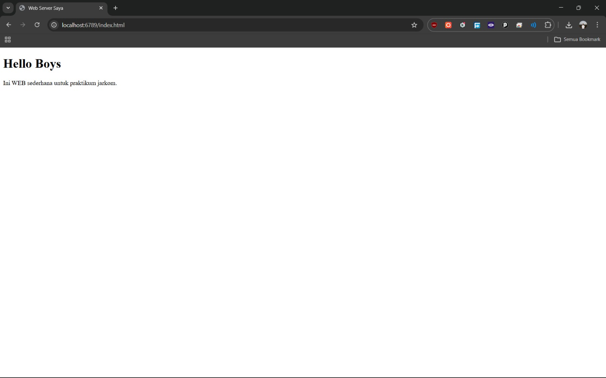
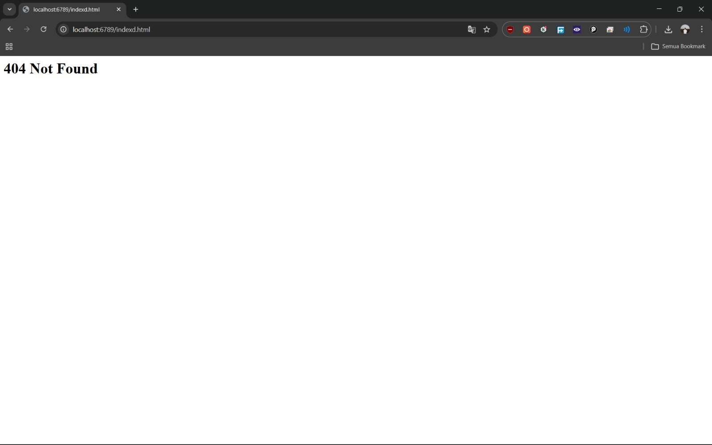

# Laporan Praktikum Jaringan Komputer - Modul 9: Web Server
**Nama:** Efran Gustine Yulianto
**NIM:** 103072400046  
**Kelas:** IF-04-02  

---

## Tujuan Praktikum
Memahami mekanisme kerja protokol **HTTP (Hypertext Transfer Protocol)** pada sisi server dengan mengimplementasikan Web Server sederhana menggunakan bahasa pemrograman Python. Praktikum ini mencakup penanganan permintaan (*request*) dari klien (browser), manajemen file pada server, serta pengiriman respons HTTP yang sesuai (200 OK atau 404 Not Found).

## Dasar Teori
Web Server bekerja berdasarkan model komunikasi *client-server* menggunakan protokol TCP pada layer transport (umumnya port 80 atau port kustom). Server bertugas mendengarkan (*listening*) koneksi masuk, memproses request URI, membaca resource yang diminta dari penyimpanan lokal, dan mengirimkannya kembali dalam bentuk paket respons HTTP yang terdiri dari *header* dan *payload*.

## Implementasi Kode

### 1. webserver.py
File ini merupakan inti dari logika server. Menggunakan modul `socket` untuk mengelola koneksi TCP.
* **Socket Binding:** Server berjalan pada port `6789`.
* **Request Handling:** Server memecah pesan HTTP untuk mendapatkan nama file yang diminta klien.
* **Error Handling:** Menggunakan blok `try-except IOError` untuk memberikan respons **404 Not Found** jika file yang diminta tidak tersedia di direktori server.

### 2. index.html
File resource sederhana yang akan disajikan oleh server saat dipanggil oleh browser klien.

## Hasil Pengujian
Pengujian dilakukan dengan mengakses alamat `localhost:6789/index.html` pada browser Brave.
* **Analisis:** Browser berhasil membangun koneksi TCP ke server, server membaca file `index.html`, mengirimkan header `HTTP/1.1 200 OK`, dan merender konten HTML pada layar browser.

### 3. Pengujian Error Handling (404 Not Found)
Selain menguji keberhasilan pemuatan file, dilakukan juga pengujian terhadap mekanisme *exception handling* pada server. Pengujian ini dilakukan dengan mencoba mengakses resource yang tidak terdaftar di direktori server, misalnya: `localhost:6789/rahasia.html`.

* **Analisis:** Saat menerima request untuk file yang tidak ada, blok `except IOError` pada skrip Python akan aktif. Server kemudian mengirimkan respons balik berupa status code `404 Not Found` beserta pesan HTML sederhana agar klien (browser) mengetahui bahwa file tersebut tidak tersedia.
* **Log Terminal:** Pada sisi server, terminal akan mencetak pesan log bahwa file terkait tidak ditemukan, sesuai dengan instruksi `print` yang ada di dalam blok `except`.

## Kesimpulan
Melalui praktikum ini, dapat disimpulkan bahwa Web Server pada dasarnya adalah aplikasi socket yang dirancang untuk mengikuti standar protokol HTTP. Penggunaan status code (seperti 200 dan 404) sangat penting agar browser klien dapat memahami status dari resource yang diminta. Keberhasilan pemuatan halaman `index.html` membuktikan bahwa server telah berhasil mengimplementasikan alur *request-response* secara akurat.